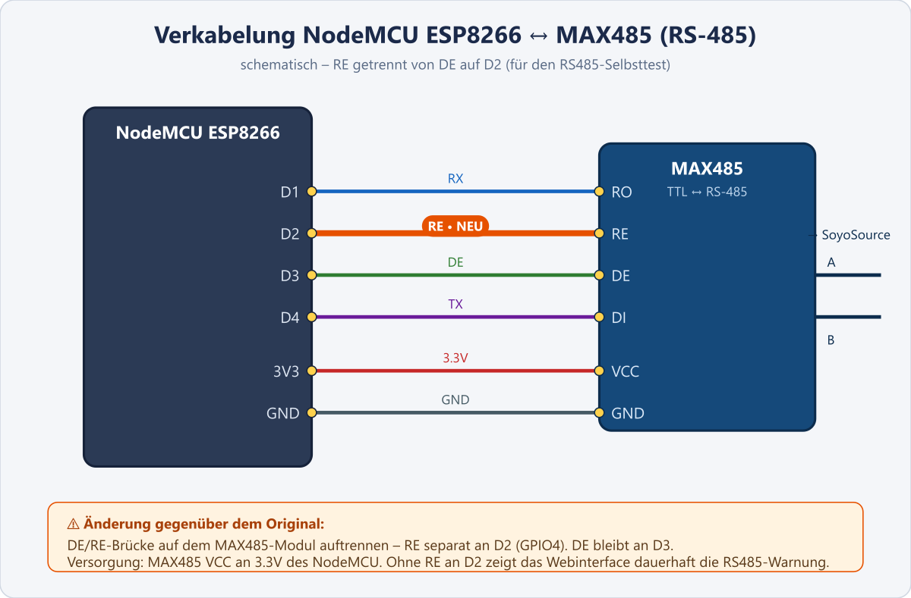

# soyosource-powercontroller

Mit diesem Projekt ist es möglich die Einspeiseleistung einens SoyoSource GTN-1000W / GTN-1200W per Webinterface durch manuelle Steuerung, Zeitplan, MQTT oder mit einem Shelly EnergyMeter als Nulleinspeisung (3EM PRO, 3EM, EM, 1PM) zu steuern.

> **Hinweis zur Weiterführung:** Dieses Projekt wurde ursprünglich von [matlen67](https://github.com/matlen67/soyosource-powercontroller) entwickelt und Ende 2024 von ihm eingestellt. Es wird seit Juni 2026 in diesem Repository weiterentwickelt und gepflegt. **Vielen Dank an matlen67 für die großartige Vorarbeit und das solide Fundament, auf dem dieses Projekt aufbaut!**

## Changelog

## Update 14.06.2026

Code-Review-Korrekturen (Stabilität & Sicherheit):
- **Nicht-blockierender MQTT-Reconnect:** Bisher hing der gesamte Loop in bis zu 15-Sekunden-Blöcken fest, wenn der MQTT-Broker nicht erreichbar war - in dieser Zeit wurden keine RS485-Leistungsbefehle mehr an den SoyoSource gesendet und das Webinterface reagierte nicht. Jetzt wird der Reconnect nicht-blockierend alle 5 s versucht, der Control-Loop läuft ununterbrochen weiter.
- **Timeout für Energiezähler-Abfragen:** Die HTTP-Abfragen (Shelly, Tasmota, HomeWizard) haben einen festen Timeout von 2 s. Ein langsamer oder offline gegangener Zähler blockiert den Loop damit nicht mehr.
- **Oberes Leistungs-Limit im Manuell-Modus:** Die Web-Buttons "+1"/"+10" begrenzen `soyo_power` jetzt auf 3000 W (wie schon die MQTT-Steuerung); vorher war der Wert nach oben unbegrenzt.
- **MQTT-Passwort nicht mehr im Klartext:** Die `/json`-Schnittstelle (jede Sekunde von der Weboberfläche abgefragt) hat das MQTT-Passwort im Klartext ausgeliefert. Es wird jetzt nur noch als Platzhalter (`********`) gesendet; beim "Save Settings" bleibt das gespeicherte Passwort erhalten, solange der Platzhalter nicht überschrieben wird. Das Eingabefeld ist zudem ein echtes Passwortfeld.
- **Offenen OTA-Endpunkt entfernt:** Die `AsyncElegantOTA`-Bibliothek (Upload beliebiger Firmware ohne Authentifizierung über `/update`) wurde entfernt - das Firmware-Update läuft ausschließlich über den abgesicherten GitHub-Weg (MD5-geprüft).
- **Robustere Schaltzeiten:** Die Timer feuern jetzt zuverlässig in ihrer Schaltminute (vorher nur in einem 2-Sekunden-Fenster, das bei kurzer Loop-Verzögerung verpasst werden konnte) und nur einmal pro Schaltvorgang.
- **Aufräumen:** Pufferüberlauf-Risiko beim Einlesen der Config (zu kleiner `key_value`-Puffer) behoben, Unsigned-Underflow bei der Update-Check-Initialisierung sauber ersetzt, ungenutzten Altcode (Reste der früheren bidirektionalen RS485-Kommunikation) entfernt.

Neue Funktionen:
- **Max Output an Anzahl Soyos koppeln:** Neue Checkbox "Max autom. (Soyos×900W)" in der Energiezähler-Karte. Ist sie aktiv, wird das Gesamt-Limit `Max Output` automatisch auf `Teiler Output × 900 W` gesetzt (jeder Soyosource max. 900 W) und das Feld schreibgeschützt; deaktiviert bleibt die manuelle Eingabe wie bisher. Der Teiler ist auf 1–6 begrenzt (mit Schutz vor Division durch 0), die Obergrenzen wurden auf 5400 W (6 × 900) angehoben.
- **RS485-Board-Erkennung (Loopback-Selbsttest):** Der Controller prüft dauerhaft (beim Boot und danach alle 15 s) per Loopback, ob ein funktionierender RS485-Transceiver angeschlossen ist. Wird keiner erkannt, erscheint im Kopfbereich des Webinterface ein rot hervorgehobener Warnbanner ("RS485-Board nicht erkannt - Verkabelung prüfen!"). **Voraussetzung:** Der Empfänger-Enable (RE) des MAX485 muss an einem eigenen GPIO hängen (NodeMCU **D2**), die DE/RE-Brücke also auftrennen (siehe Abschnitt "Schaltung"). Wird die bisherige Verkabelung mit DE/RE gemeinsam an D3 beibehalten, zeigt der Header dauerhaft die Warnung.

## Update 12.06.2026
Projekt wird ab jetzt in diesem Repository weitergeführt, das Repository ist nun öffentlich. GitHub Action für automatische Release-Builds eingerichtet (bei einem Versions-Tag `v*` wird die Firmware automatisch gebaut und als Release mit `firmware.bin.gz` und `manifest.json` veröffentlicht).

Neue Funktion: Wählbare Meter-Quelle für die Nulleinspeisung (siehe Abschnitt "Meter-Quellen" unten):
- Shelly (HTTP) - wie bisher, unverändert (Standard)
- Tasmota (HTTP) - z.B. IR-Lesekopf am Stromzähler, Leistungswert über konfigurierbaren JSON-Pfad
- MQTT-Topic - beliebiges Topic (Zahl oder JSON), mit Ausfall-Überwachung: nach 30 s ohne Wert wird sicherheitshalber auf 0 W geregelt
- HomeWizard (HTTP) - P1 Meter, Energy Socket und kWh Meter über die lokale API

Bugfix: MQTT-Payloads wurden in einen zu kleinen Puffer (8 Byte) kopiert - Payloads über 7 Zeichen haben Speicher überschrieben. Puffer auf 512 Byte vergrößert und Längenprüfung ergänzt.

Neue Funktion: Firmware-Update direkt aus GitHub. Der Controller prüft einmal täglich (und per Button "Jetzt prüfen" in der ESP-Karte) anhand von `manifest.json` das neueste GitHub-Release. Ist eine neue Version verfügbar, erscheint ein "Update installieren"-Button. Ein Klick löst einen Neustart aus; direkt nach dem Booten (noch vor WiFiManager, Webserver und MQTT, damit genug freier Speicher zur Verfügung steht) verbindet sich der ESP kurz mit dem WLAN und lädt `firmware.bin.gz` vom GitHub-Release in 4-KB-Blöcken per HTTP-Range-Requests über eine wiederverwendete HTTPS-Verbindung herunter (GitHub liefert bei großen Antworten 16-KB-TLS-Records, für deren Puffer der Heap des ESP8266 nicht reicht - kleine Blöcke umgehen das). Vor dem Flashen wird die MD5-Prüfsumme aus `manifest.json` verifiziert; bei Fehlern bleibt die bisherige Firmware unverändert. Bei Erfolg startet der ESP automatisch mit der neuen Version neu. Die Firmware-Version wird jetzt aus `FW_VERSION` im Webinterface angezeigt (Kopfzeile war vorher hartkodiert). Auf Hardware getestet: Update von v1.241013 auf v1.260612 erfolgreich über OTA installiert.

Home Assistant Integration per MQTT Discovery hinzugefügt (siehe Abschnitt "Home Assistant Integration" unten).

Build-Fehler in platformio.ini behoben, damit das Projekt wieder erfolgreich mit PlatformIO kompiliert:
- Tippfehler beim Library-Namen korrigiert: `me-no-dev/ESP Async WebServer` -> `me-no-dev/ESPAsyncWebServer`.
- Build-Flag `TEMPLATE_PLACEHOLDER` portabel gemacht (`126` statt `(char)126` mit Anführungszeichen), damit der Build auch unter Linux (GitHub Actions) funktioniert.
- `ayushsharma82/AsyncElegantOTA@^2.2.8` wurde aus der PlatformIO-Registry entfernt; die Library wird jetzt als Version 2.2.8 direkt im Projekt unter `lib/AsyncElegantOTA` mitgeliefert (vendored), um Konflikte mit neueren ESPAsyncWebServer-Versionen zu vermeiden.

Verbesserungen am Webinterface und MQTT (auf Hardware getestet):
- MQTT-Server/Port lassen sich jetzt über "Save Settings" ändern, ohne dass ein Neustart des ESP nötig ist (Verbindung wird sofort mit den neuen Daten neu aufgebaut).
- Der MQTT-Verbindungsstatus wird jetzt jede Sekunde live im Webinterface aktualisiert (vorher nur beim Laden der Seite).
- Im Debug-Log wird bei fehlgeschlagener MQTT-Verbindung jetzt der PubSubClient-Fehlercode mit ausgegeben (`reconnect failed! state=...`).

Webinterface überarbeitet (auf Hardware getestet):
- Neue eigene Karte "Firmware-Update" mit den Funktionen "Jetzt prüfen", "Update installieren" und Status-Anzeige - der bisherige Update-Button am Seitenende (AsyncElegantOTA-Link) wurde entfernt.
- Neue Option "Automatische Updates": ist sie aktiviert, installiert der ESP ein erkanntes Firmware-Update beim nächsten Prüfzyklus automatisch, ohne Klick auf "Update installieren".
- Karte "Shelly 3EM" in "Energiezähler" umbenannt, da nun auch andere Meter-Quellen unterstützt werden. Neue Zeile "Erkannter Typ" zeigt den per Meter-Quelle erkannten Gerätenamen an.
- Im Energiezähler-Menü werden MQTT- und JSON-Pfad-Felder nur noch angezeigt, wenn die jeweils ausgewählte Meter-Quelle sie benötigt (nicht bei Shelly).

Bugfix Webinterface (auf Hardware getestet): Die Status-Anzeigen "Nulleinspeisung", "Batterieschutz" und "Timer" (EIN/AUS) sowie WiFi-Signalstärke/-Qualität wurden bisher nur beim Laden der Seite aktualisiert. Nach Umschalten der "Aktiv"-Checkbox (z.B. Batterieschutz aktivieren) blieb die Anzeige auf dem alten Wert stehen, bis die Seite manuell neu geladen wurde. Diese Felder werden jetzt wie alle anderen Live-Werte jede Sekunde aktualisiert. Ebenso wird die angezeigte Firmware-Version (Kopfzeile und Firmware-Update-Karte) jetzt jede Sekunde aktualisiert, damit nach einem Selbst-Update per OTA sofort die neue Version angezeigt wird, ohne die Seite neu laden zu müssen.

## Update 13.06.2026

Bugfix Webinterface (auf Hardware getestet): Im Energiezähler-Menü wurden die MQTT-Topic- und JSON-Pfad-Zeilen nach einem Neuladen der Seite teils fälschlich angezeigt, obwohl die gewählte Meter-Quelle (z.B. Shelly) sie nicht benötigt. Sie verschwanden erst, wenn die Meter-Quelle einmal manuell umgeschaltet wurde. Die Sichtbarkeit dieser Zeilen wird jetzt - wie die anderen Live-Werte - jede Sekunde neu anhand der aktuell gewählten Meter-Quelle berechnet, sodass sie auch direkt nach dem Laden korrekt ein-/ausgeblendet sind.

Bugfix Webinterface (auf Hardware getestet): Die Checkboxen "Nulleinspeisung aktiv", "Batterieschutz aktiv" und "Timer 1/2 aktiv" wurden bisher nur beim Laden der Seite gesetzt. Werden diese Funktionen über Home Assistant per MQTT (`<mqtt_root>/null/set`, `.../batschutz/set`, `.../timer1/set`, `.../timer2/set`) ein- oder ausgeschaltet, während die Webseite geöffnet ist, blieb die Checkbox auf dem alten Stand. Diese Checkboxen werden jetzt wie die zugehörigen Status-Anzeigen jede Sekunde mit dem aktuellen Zustand synchronisiert.

Dokumentation: Abschnitt "PlatformIO" um eine Anleitung zur Erstinbetriebnahme ergänzt (Bauen/Flashen, WLAN-Einrichtung über den Access Point `soyo_XXXXXX`, sowie Hinweis, dass ein lokaler Build immer die Platzhalter-Version `1.241013` anzeigt und direkt danach über "Update installieren" auf den aktuellen Stand gebracht werden sollte).

## Update 21.12.2024
*(Hinweis des ursprünglichen Entwicklers matlen67:)*
Ich bin auf einen Multiplus-II umgestiegen und werde daher an diesem Projekt nicht mehr weiterarbeiten.
Bis dato hat der soyosource-powercontroler einwandfrei funktioniert.

## Funktionsweise
Der SoyoSource kann die Energie DC-Seitig aus PV-Module oder aus einer Batterie beziehen. Die AC-Einspeiseleistung kann im Einstellmenü des SoyoSource als Festwert in Watt oder durch einen auf einer Phase angeschlossenen SoyoSource Limiter bereitgestellt werden. Der Limiter wird per RS485-Schnittstelle am SoyoSource angeschlossen und sendet dann die auf der Phase anliegende Leistung an den SoyoSource.

Hinweis. Die aktuellen Versionen der SoyoSource Einspeisewechselrichter geben keine Daten mehr über die RS485-Schnittstelle aus, somit ist ein Auslesen von SoyoSource Informationen nicht möglich. Leider liegen mir aktuell keine Informationen vor ob der Sendevorgang per Software/Hardware deaktiviert wurde oder ob es nur neue Parameter bedarf um den SoyoSource zum Senden zu bewegen.

Diese Steuerung in Verbindung mit der Schaltung aus Bild 1 ersetzt den SoyoSource Limiter. Damit die Leistungsvorgabe dieser Steuerung funktioniert, muss im Einstellmenü des SoyoSource der Limitermode aktiviert werden (Bild 2).
Die manuelle Steuerung über das Webinterface sowie per MQTT oder Zeitplan funktionieren soweit, lediglich die Nulleinspeisung habe ich erst im Dezember 2023 mit eingebaut und kann diese erst im Frühjar 2024 testen und optimieren.

Achtung, ich überneheme keinerlei Haftung für Schäden an Personen oder Hardware die durch dieses Projekt entstehen. Arbeiten an Spannungen größer 24V sollten nur von Fachpersonal durchgeführt werden!  
 

## PlatformIO
Dieses Projet wurde von der Ardunino IDE zu PlatformIO portiert

### Bauen und Flashen
1. Projekt mit PlatformIO öffnen (Umgebung `nodemcuv2`).
2. NodeMCU/ESP8266 per USB anschließen.
3. Bauen und Flashen, z.B. über die Kommandozeile: `pio run -e nodemcuv2 -t upload --upload-port COMx` (Port anpassen) oder über die PlatformIO-Buttons "Build"/"Upload" in der IDE.

### Erste Inbetriebnahme (WLAN einrichten)
Beim ersten Start ohne gespeicherte WLAN-Zugangsdaten startet der ESP einen eigenen Access Point mit dem Namen `soyo_XXXXXX` (XXXXXX = letzte 3 Byte der MAC-Adresse, im Webinterface später als "Client-ID" sichtbar).
1. Mit dem WLAN `soyo_XXXXXX` verbinden.
2. Es öffnet sich automatisch das Konfigurationsportal (falls nicht, manuell `http://192.168.4.1` aufrufen).
3. WLAN-SSID und -Passwort des Heimnetzes eingeben, optional auch MQTT-Server/Port/Benutzer/Passwort.
4. Speichern - der ESP verbindet sich mit dem WLAN und ist danach unter seiner IP-Adresse (per DHCP) im Heimnetz erreichbar.

### Hinweis zur Firmware-Version nach dem Erstflash
Ein lokal mit PlatformIO erstellter Build zeigt im Webinterface immer die Platzhalter-Version `1.241013` an (`FW_VERSION` in `main.cpp`), unabhängig vom tatsächlichen Code-Stand - dieser Wert wird nur von der GitHub-Release-Pipeline beim Veröffentlichen eines Versions-Tags auf den jeweiligen Tag-Namen gesetzt.

Um direkt nach dem Erstflash auf dem aktuellen veröffentlichten Stand zu sein, im Webinterface in der Karte "Firmware-Update" auf "Jetzt prüfen" und danach auf "Update installieren" klicken - der ESP lädt die aktuelle Version automatisch von GitHub und startet danach mit der korrekten Versionsnummer im Header neu.

## Arduino IDE 2.1.0
Wer dieses Projekt weiterhin mit der Arduino IDE nutzen möchte muss die Datei main.cpp nach 'soyosource-powercontroller.ino' umbenennen und diese  mit der html.h in einen Ordner mit den Namen 'soyosource-powercontroller' kopieren.

#benötigte Librarys
 - ESPAsync_WiFiManager (https://github.com/khoih-prog/ESPAsync_WiFiManager)
 - ESPAsyncWebServer    (https://github.com/me-no-dev/ESPAsyncWebServer) Bitte Hinweis lesen
 - ESPAsyncTCP          (https://github.com/me-no-dev/ESPAsyncTCP)
 - Uptime               (https://github.com/XbergCode/Uptime)

#### Hinweis ESPAsyncWebServer bei verwendung der Arduino IDE 
Innerhalb der Library ist das Prozentzeichen '%' als Platzhalter definiert. Variablen die vom Platzhalter umschlossen sind können so später durch gesendeten Code vom Webserver ersetzt werden um z.B. Daten von Sensoren dazustellen. Leider interpretiert der Webserver aber auch das Prozentzeichen in CSS oder HTML Code falsch, so das 
z.B. bei der Angabe des property's wie xyz{ widht: 90%; } das % Zeichen entfernt wird. Dieses führt folglich zu Fehldarstellungen der Website. Als Workaround hilft Angaben mit Prozentzeichen immer doppelt anzugeben xyz{ width:90%%; } oder man ersetzt in der Library das Platzhalter Zeichen.
Ich habe in meiner Library unter dem Library-Ordner ESP Async WebServer/src die Datei 'WebResponseImpl.h' angepasst und den Platzhalter ersetzt:

#define TEMPLATE_PLACEHOLDER '%' 

durch

#define TEMPLATE_PLACEHOLDER '~'

ersetzen

#### Wer platformio nutzt brauch das % nicht ändern, da ist es in der platformi.ini als build flag hinterlegt

## Schaltung
### Bauteile
- NodeMCU mit ESP8266 (ESP-12F) (4MB Flash)
- RS485 Entwicklungsboard TTL zu RS485, MAX485

Hinweis: Das RS485 Entwicklungsboard verwendet einen MAX485 Pegelwandler der für eine Versorgungsspannung von 5V ausgelegt ist. Da die GPIO's des ESP8266 dauerhaft nur 3.3V vertragen wird die Spannung Vcc vom RS485 Entwicklungsboard am 3.3V Ausgang des NodeMCU abgegriffen. Das RS485 Etwicklungsboard arbeitet auch zuverlässig mit 3.3V. Die 5V Spannungsversorgung des NodeMCU kann entweder über USB oder den Anschlus-Pin VIN erfolgen.

### Verkabelung NodeMCU ↔ MAX485

| NodeMCU | MAX485 | Funktion |
|---|---|---|
| D1 | RO | Receiver Output (Empfangen) |
| D4 | DI | Driver Input (Senden) |
| D3 | DE | Driver Enable (Sendebetrieb) |
| D2 | RE | Receiver Enable (für RS485-Selbsttest) |

Der **RS485-Loopback-Selbsttest** läuft dauerhaft (beim Boot und alle 15 s). Dafür muss RE **getrennt** von DE an **D2** angeschlossen werden (DE/RE-Brücke auf dem Board auftrennen). Der Test aktiviert kurzzeitig Treiber und Empfänger gleichzeitig und prüft, ob der gesendete Pegel am Empfänger zurückkommt. Kommt er nicht zurück (kein/defektes Board oder RE nicht an D2), zeigt das Webinterface im Kopfbereich einen roten Warnbanner.

Hinweis: Wer die bisherige Verkabelung mit DE und RE gemeinsam an D3 beibehält, sieht den Warnbanner dauerhaft - in dem Fall RE auf D2 umlegen.

### Bild 1: Schaltung

Aktuelle Verkabelung (RE getrennt auf D2 für den RS485-Selbsttest):

Ursprüngliche Verkabelung (DE/RE gemeinsam an D3, ohne Selbsttest):

### Bild 2: Einstellmenü SoyoSource
Hier muss 'Bat AutoLimit Grid' auf Y stehen

  

## Webif
 

 

## Meter-Quellen (Nulleinspeisung)

Die Quelle für den aktuellen Netzbezug ist im Webinterface in der Meter-Karte über das Dropdown "Meter-Quelle" wählbar:

| Quelle | Felder | Hinweise |
|---|---|---|
| Shelly (HTTP) | Meter IP | 3EM PRO, 3EM, EM, 1PM, Plus 1PM - der Typ wird automatisch erkannt. Phasen L1-L3 einzeln abwählbar. |
| Tasmota (HTTP) | Meter IP, JSON-Pfad | z.B. IR-Lesekopf am Stromzähler. Abfrage über `Status 8`; der JSON-Pfad zeigt auf den Leistungswert im `StatusSNS`-JSON, z.B. `MT175.P` oder `SML.Power_curr` (mit oder ohne `StatusSNS`-Präfix). |
| MQTT-Topic | MQTT-Topic, JSON-Pfad | Payload entweder nackte Zahl (z.B. `153`) oder JSON (dann JSON-Pfad angeben). MQTT muss aktiviert sein. Sicherheitsfunktion: kommt 30 s lang kein Wert, wird auf 0 W geregelt und "MQTT Meter offline" angezeigt. |
| HomeWizard (HTTP) | Meter IP | P1 Meter, Energy Socket, kWh Meter über die lokale API (`/api/v1/data`). Dafür in der HomeWizard Energy App die "Lokale API" aktivieren. Beim P1 Meter sind die Phasen L1-L3 einzeln abwählbar. |

Konvention: positiver Wert = Netzbezug. Liefert die Quelle das Vorzeichen umgekehrt, die Option "Wert invertieren" aktivieren.

## Home Assistant Integration

Wenn MQTT aktiviert ist, meldet sich der Controller per Home Assistant MQTT Discovery automatisch am Broker an. Es ist keine manuelle YAML-Konfiguration in Home Assistant nötig - das Gerät erscheint unter "SoyoSource soyo_xxxxxx" mit folgenden Entities:

**Sensoren**
- Power (W)
- Meter Power (W)
- Uptime
- WiFi Signal (%)

**Schalter**
- Nulleinspeisung
- Timer 1 / Timer 2
- Batterieschutz

**Zahlenwerte (Number)**
- Power Setpoint (W)
- Teiler Output
- Max Output (W)
- Nullpunkt-Offset (W)

Voraussetzung: Im Webinterface unter "MQTT" Server, Port und ggf. Zugangsdaten eintragen und aktivieren. Die Discovery-Konfigurationen werden bei jeder MQTT-Verbindung retained an `homeassistant/...` gesendet, Statuswerte alle 5 Sekunden aktualisiert.

Hinweis: Änderungen über Home Assistant werden nicht automatisch in `config.json` gespeichert - dafür im Webinterface auf "Save Settings" klicken.

